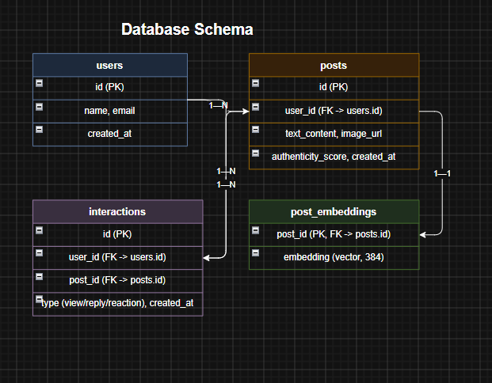
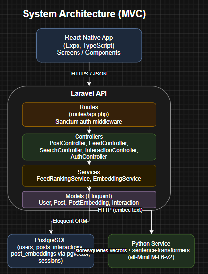

# Technical Solution Document — Real Connections Feed
**Guised Up | Full-Stack Assessment**

## 1. What This Feature Does

The Real Connections Feed shows posts ranked by how genuine and relevant they are — not by likes, shares, or comments. Four things decide where a post lands in the feed:

1. **Authenticity** — plainer, less "curated" posts rank higher
2. **Relationship depth** — posts from people you actually interact with (not just follow) rank higher
3. **Semantic relevance** — posts about topics you care about, found using AI-generated embeddings
4. **Time decay** — newer posts get a boost, but a great older post can still beat a mediocre new one

Users can also search in plain English (e.g. "funny travel stories from last week") and get back posts that match the *meaning* of the search, not just matching keywords.

## 2. System Architecture

```
React Native App (Expo, TypeScript)
            │
            ▼
   Laravel API (PHP, Sanctum auth)
            │
   ┌────────┴─────────┐
   ▼                   ▼
PostgreSQL          Python Service
(users, posts,      (Flask + sentence-transformers,
 interactions,       turns text into embeddings)
 pgvector column
 for embeddings)
```
## 2. System Architecture




**When someone creates a post:** the app sends it to Laravel → Laravel saves it in Postgres → Laravel asks the Python service to turn the text into an embedding (a list of numbers representing its meaning) → that embedding gets saved in Postgres using the `pgvector` extension.

**When someone opens their feed or searches:** Laravel pulls posts from Postgres, uses `pgvector` to check which posts are most similar in meaning to what the user cares about, combines that with the other three ranking signals, and sends back a sorted list.

## 3. Why Postgres + pgvector

We picked `pgvector` — a plugin that adds AI-style similarity search directly into Postgres — instead of a separate vector database like Pinecone, Weaviate, Qdrant, or Chroma.

**Why this is simpler:**
- One database instead of two — less to set up, run, and maintain
- Postgres can already join "posts similar to X" with "posts from people I talk to" in a single query, since everything lives in the same place
- More than fast enough for a project at this stage — dedicated vector databases mostly pay off at a much bigger scale (millions of posts), which isn't a concern yet

**Trade-off:** if Guised Up grew huge, a dedicated vector database built purely for search speed at massive scale might eventually make sense. Not needed today.

## 4. How Embeddings Are Generated

We use a real, working AI model — **`sentence-transformers` (all-MiniLM-L6-v2)** — running inside a small Python service (Flask). This isn't a placeholder or a mock; it's an actual open-source model that turns any piece of text into a 384-number vector capturing its meaning. It runs locally, is free, and needs no API key.

Laravel calls this Python service over a simple internal HTTP request whenever a post is created or a search is run.


## 5. Database Design



**Tables:**
```
users            — id, name, email, created_at
posts            — id, user_id, text_content, image_url, authenticity_score, created_at
post_embeddings  — post_id, embedding (pgvector column, 384 numbers)
interactions     — id, user_id, post_id, type (view / reply / reaction), created_at
sessions         — Laravel's own table, needed because we use database-backed sessions
```

**Relationships:**
- One user has many posts (`posts.user_id` → `users.id`)
- One user has many interactions (`interactions.user_id` → `users.id`)
- One post has many interactions (`interactions.post_id` → `posts.id`)
- One post has exactly one embedding (`post_embeddings.post_id` → `posts.id`)

**Indexes:**
- `posts(user_id, created_at)` — speeds up "get a user's posts, newest first"
- `interactions(user_id, created_at)` — speeds up "what has this user interacted with recently"
- `interactions(post_id)` — speeds up "how many interactions does this post have"
- `post_embeddings` uses an `ivfflat` index (a pgvector-specific index type) so similarity search doesn't have to scan every row

**Why one `interactions` table instead of three:** views, replies, and reactions all have the same shape (who did what, to which post, and when). Keeping them in one table with a `type` column makes counting and combining them much simpler than joining three separate tables.

## 6. API Design

**Auth strategy:** Laravel Sanctum, token-based. A user registers or logs in, gets back a token, and sends that token as a `Bearer` header on every other request. This is simpler than cookie-based auth and works naturally for a mobile app.

| Endpoint | What it does |
|---|---|
| `POST /api/register`, `POST /api/login` | Create an account / get a token |
| `POST /api/posts` | Create a post (auto-generates its embedding) |
| `GET /api/feed` | Get your personalized, ranked feed (paginated) |
| `GET /api/search?q=...` | Natural-language search across posts |
| `POST /api/interactions` | Log a view, reply, or reaction |

**Example — creating a post:**
```
POST /api/posts
Authorization: Bearer {token}

Request:
{ "text_content": "Hiked a new trail today, no filter needed.", "image_url": null }

Response (201):
{ "id": 42, "text_content": "...", "image_url": null, "created_at": "..." }
```

**Example — getting the feed:**
```
GET /api/feed?page=1
Authorization: Bearer {token}

Response (200):
{
  "data": [
    { "id": 1, "user": { "id": 2, "name": "Sam" }, "text_content": "...", "score": 0.83 }
  ],
  "current_page": 1,
  "per_page": 20,
  "has_more": true
}
```

**Example — searching:**
```
GET /api/search?q=funny travel stories from last week
Authorization: Bearer {token}

Response (200):
{ "data": [ { "id": 7, "text_content": "...", "semantic_score": 0.91 } ] }
```

**Example — logging an interaction:**
```
POST /api/interactions
Authorization: Bearer {token}

Request:
{ "post_id": 7, "type": "reaction" }

Response (201):
{ "success": true }
```

## 7. How the Ranking Actually Works

**In plain English:** every post gets scored on four things — how authentic it seems, how close your relationship is with the poster, how well it matches what you're interested in, and how recent it is. Those four scores get combined into one number, using more weight on relationship and relevance than on authenticity or recency. Posts are then sorted by that number, highest first.

**In pseudocode:**
```
function rank_feed(user, candidate_posts):
    interest_vector = average_embedding(posts_user_recently_interacted_with(user))

    for post in candidate_posts:
        authenticity = post.authenticity_score
        relationship = relationship_depth(user, post.author)
        semantic     = cosine_similarity(post.embedding, interest_vector)
        age_hours    = hours_since(post.created_at)
        time_decay   = exp(-DECAY_RATE * age_hours)

        post.score = 0.25 * authenticity
                   + 0.30 * relationship
                   + 0.30 * semantic
                   + 0.15 * time_decay

    return sort(candidate_posts, by=score, descending=True)

function relationship_depth(user, author):
    interactions = interactions_between(user, author, last_90_days)
    weighted = interactions.views * 1 + interactions.replies * 3 + interactions.reactions * 2
    return normalize(weighted, against=user's highest weighted total with anyone)
```

- **Authenticity** is a simple starting estimate (e.g. longer, more thoughtful posts score a bit higher) — a real version would also look at things like image filter usage.
- **Relationship depth** looks at how much you've interacted with a post's author recently (replies and reactions count more than passive views).
- **Semantic similarity** compares a post's embedding to an "interest profile" built from posts you've recently engaged with, using `pgvector`'s built-in similarity comparison.
- **Time decay** fades a post's freshness boost over roughly 48 hours (the `DECAY_RATE` constant), so the feed stays recent without being purely chronological.

## 8. What AI Tools Were Used, Honestly

This project was built with heavy use of AI coding assistants (Claude and ChatGPT), used for:
- Thinking through the architecture and ranking logic
- Writing boilerplate (migrations, controllers, routes) faster
- Debugging real issues that came up while running the project locally, including:
  - A missing Metro/Babel config that stopped the mobile app from bundling at all
  - A corrupted screen file that was causing the app to crash immediately on launch
  - A missing native dependency (`react-native-worklets`) needed for the animation library to work
  - API routes that existed in code but were never actually registered, so no endpoint worked
  - A missing database table for session storage

Using AI tools didn't remove the need to understand *why* something broke — most of the real bugs above needed actually reading error messages and tracing through the code, not just accepting a suggested fix.

## 9. Trade-offs and Assumptions

- **Authenticity scoring** is a basic heuristic today, not a trained model — a production version would likely analyze image metadata and writing patterns more deeply.
- **Ranking weights** (0.25 / 0.30 / 0.30 / 0.15) are reasonable starting defaults, not tuned against real user data yet.
- The mobile app was rebuilt in TypeScript partway through for better type safety and fewer runtime surprises — the UI was also redesigned (consistent colors, spacing, and typography) so it doesn't look like default React Native styling.
- Search is built directly into the Feed screen (one search bar, results shown inline) instead of being a separate screen, for a smoother experience.
- pgvector was chosen assuming moderate scale; a dedicated vector database would be revisited if the post volume grew into the millions.
